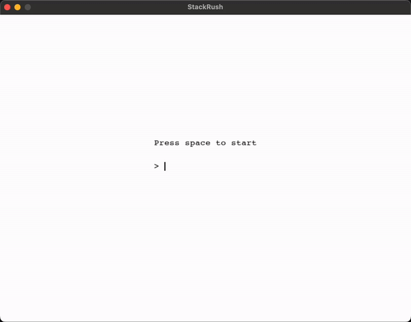

# StackRush

**StackRush** is a vintage pixel game made with `pygame` where you have to stack blocks according to the tempo of a metronome that accelerates as precisely as possible to achieve high scores and be on the podium ! You can either play it with a small controller or on you keyboard ! (the analysis of the games are in the jupyter notebook)

## Table of Contents
1. [Gameplay](#gameplay)
2. [Controller](#controller)
3. [File Structure](#classes)
4. [Installation and Setup](#installation-and-setup)

---

## Gameplay

1. **Start Menu**: 
   - Enter your player name to begin.
   - Press **Space** to start stacking blocks.

2. **Stacking Blocks**:
   - Blocks slide horizontally across the screen. Press **Space** to drop each moving block on top of the stack.
   - If your block is not aligned with the previous one, only the overlapping portion remains, making subsequent blocks smaller and more challenging to place.
   - Every 20 blocks, only the last two blocks will remain on-screen to maintain performance and focus.

3. **Increasing Difficulty**:
   - Throughout the game, the tempo of the moving blocks increases, adding to the challenge.

4. **Game Over**:
   - The game ends when a block falls completely outside the last placed block. Your score is then saved and if it surpasses your previous high score your high score will be updated.

5. **Leaderboard and Pause**:
   - After game over, your high score is stored in a CSV file, so a leaderboard of the top 10 players is displayed if you press **P** to pause the game and **P** again to get out of the pause menu.

### Here's a demo and if you want I also have the demo with the controller in the video file but for this one I didn't have enough players yet to display the top 10



## Controller

If you want to use a controller you have the script for the only button required and you will need an Arduino or compatible microcontroller.
Make sure your COM port is correctly set in the Python script.

## Classes

- **Game**: Controls the game flow, scoring, block spawning, and handles events.
- **Menu**: Manages the start and game-over menus, including the player name input.
- **Player**: Manages player data, including saving scores and retrieving high scores.
- **Block**: Represents each stackable block, controls movement, and handles overlap calculations.

## Data
The game maintains a `Players` folder, where each player's data is stored in a separate `.csv` file. This setup allows the game to display a leaderboard based on these scores and to make the jupyter notebook the interpret this data. Concerning the Jupyter notebook it is interactive, you can choose the players to plot but in order to do that you must clone the repository or else you will not be able to choose and only have the default plots.

## Installation and Setup

1. Clone or download this repository.
2. Ensure you have Python and `Pygame` installed. You can install `Pygame` via:
   ```bash
   pip install -r requirements.txt

